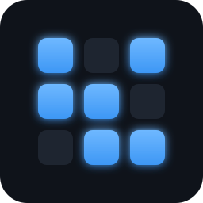
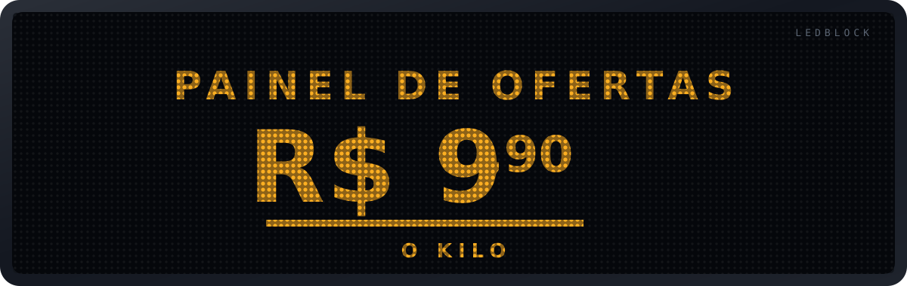
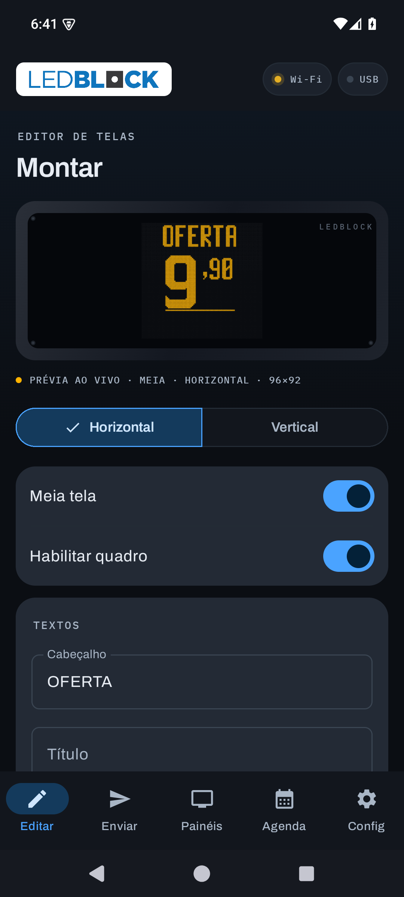
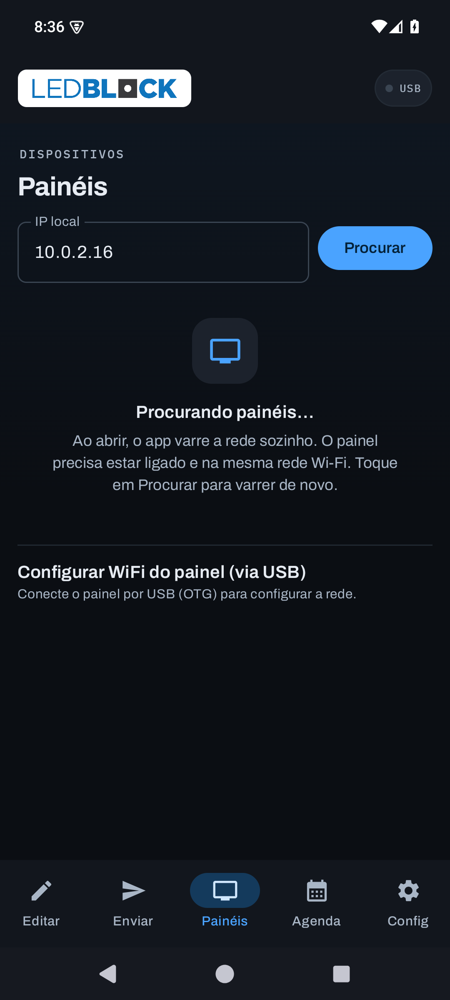
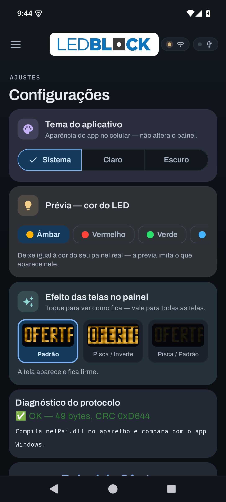
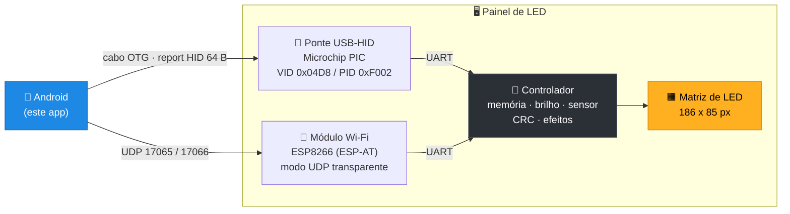
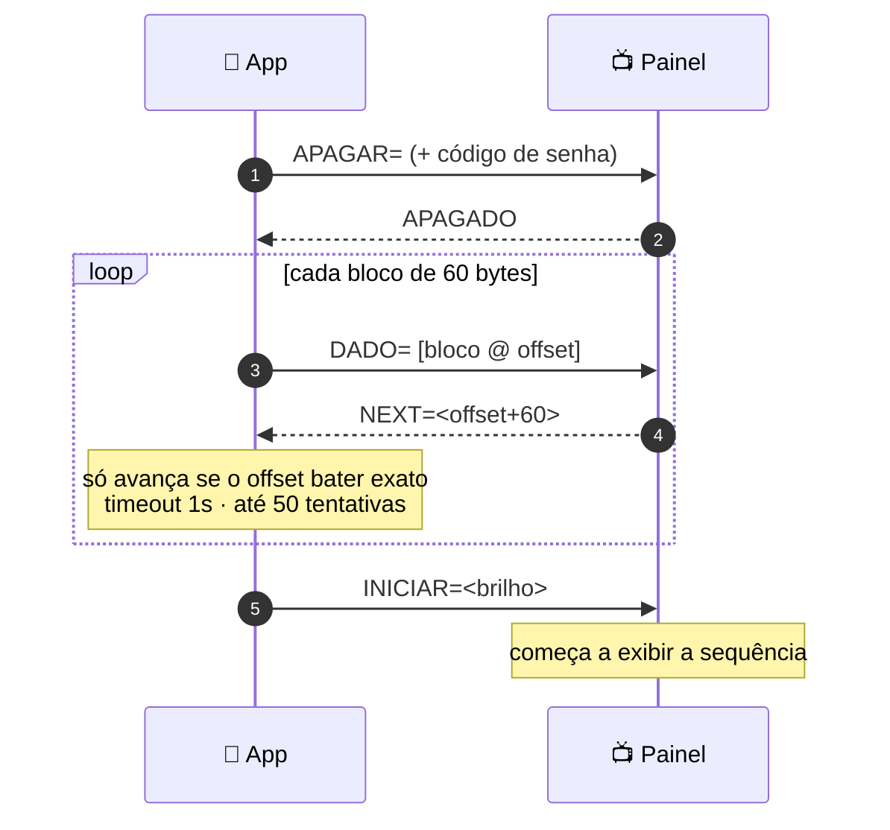
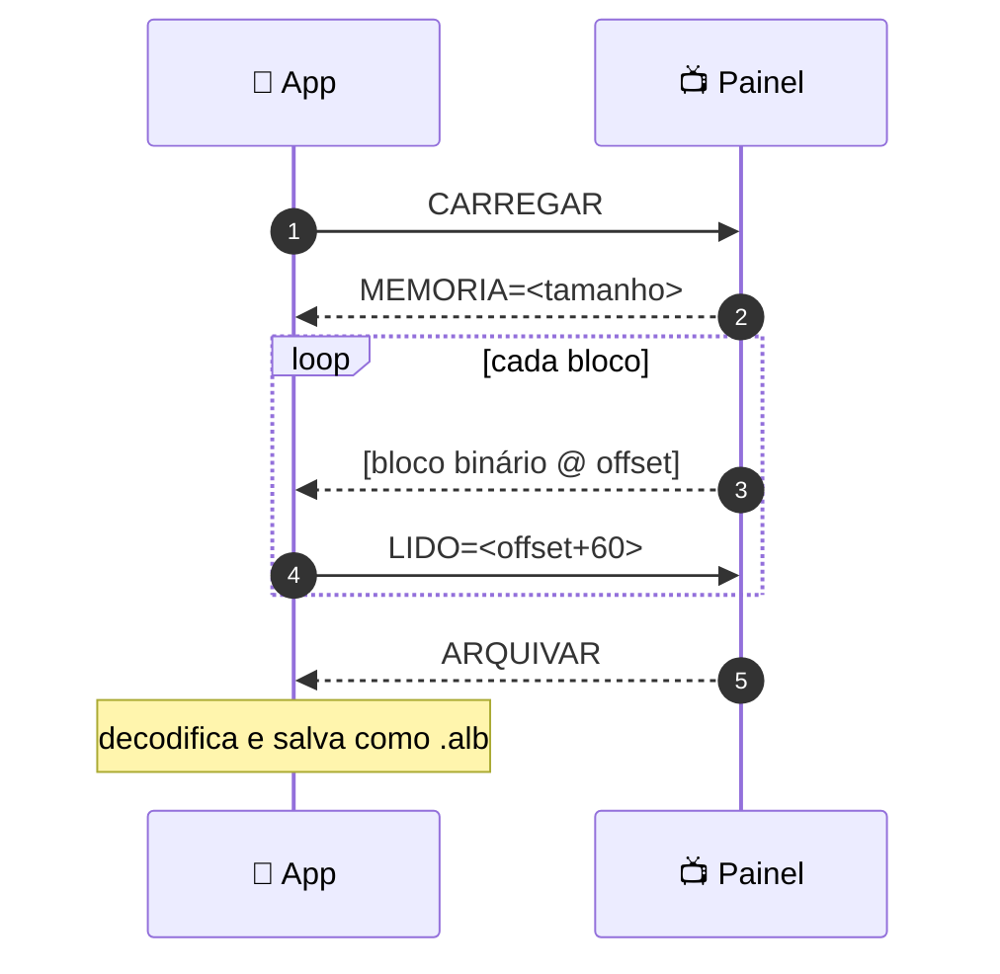
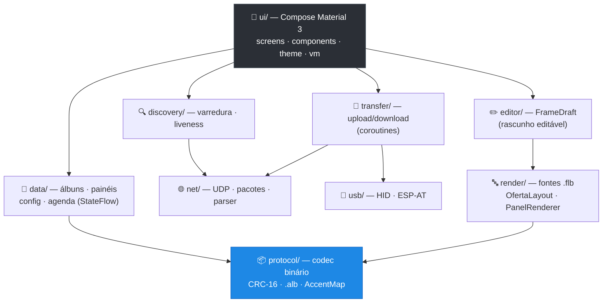

<div align="center">



# Painel de Ofertas — Android

**Porte Android nativo do software Windows que controla painéis de LED de ofertas.**
Monte preços e mensagens no celular e envie ao painel por **Wi-Fi** ou **cabo USB**.

<br>

[](https://github.com/ChrnX0/painel-ofertas-android/actions/workflows/android.yml)
[-3DDC84?logo=android&logoColor=white)](#-começando)
[](#-arquitetura)
[](#-arquitetura)
[](#-testes)
[](#-protocolo)
[](#%EF%B8%8F-status-do-projeto)
[](LICENSE)

<br>



</div>

---

## 📱 O app

<div align="center">



<br>
<sub><b>Editar</b> · prévia de LED ao vivo no tamanho real &nbsp;|&nbsp; <b>Painéis</b> · varre a rede sozinho &nbsp;|&nbsp; <b>Config</b> · tema, cor do LED e diagnóstico</sub>
<br><br>
<sub>🖼️ Todas as telas, incluindo o <b>tema claro</b>: <a href="docs/CAPTURAS.md">docs/CAPTURAS.md</a></sub>
</div>

---

## 📚 Documentação

> **É desenvolvedor e vai pegar este projeto? Comece por aqui 👇**

<table>
<tr>
<td width="25%" align="center">

### 🚦
**[Comece aqui](docs/COMECE-AQUI.md)**

Onboarding em 30 min: glossário, ambiente, o caminho completo de um preço, roteiro de leitura e **as armadilhas**

</td>
<td width="25%" align="center">

### 🏗️
**[Arquitetura](docs/ARQUITETURA.md)**

Mapa **arquivo por arquivo**: o que cada um faz, o que pode importar o quê, e por quê

</td>
<td width="25%" align="center">

### 📡
**[Protocolo](docs/PROTOCOLO.md)**

A **especificação completa**: formato, bytes, comandos, CRC, USB, ESP-AT e vetores de teste

</td>
<td width="25%" align="center">

### 🍳
**[Receitas](docs/RECEITAS.md)**

"Como faço X?" — 12 tarefas comuns passo a passo, com os arquivos exatos

</td>
</tr>
</table>

<table>
<tr>
<td width="25%" align="center">

### 🧭
**[Decisões](docs/DECISOES.md)**

**"Por que é assim?"** — 13 decisões com contexto, motivo e quando revisar

</td>
<td width="25%" align="center">

### ❓
**[FAQ](docs/FAQ.md)**

Perguntas frequentes sobre o app, o painel e o projeto

</td>
<td width="25%" align="center">

### ✅
**[Handoff](HANDOFF.md)**

Roteiro de **10 passos** para validar contra um painel real

</td>
<td width="25%" align="center">

### 🖼️
**[Exemplos](docs/EXEMPLOS.md)**

**Veja** o efeito de cada opção no painel, com renderizações reais

</td>
</tr>
</table>

<sub>📋 Histórico de versões: **[CHANGELOG.md](CHANGELOG.md)**</sub>

Vai contribuir? **[CONTRIBUTING.md](CONTRIBUTING.md)** — com a regra que mais importa:
*mudou `protocol/`, o teste compara bytes.*

---

## 📑 Índice

| | | |
|---|---|---|
| [🎯 Sobre](#-sobre) | [✨ Funcionalidades](#-funcionalidades) | [💡 Além do original](#-recursos-além-do-app-windows) |
| [🔌 Hardware](#-como-o-hardware-funciona) | [📡 Protocolo](#-protocolo) | [🏗️ Arquitetura](#️-arquitetura) |
| [🚀 Começando](#-começando) | [🧪 Testes](#-testes) | [⚠️ Status](#️-status-do-projeto) |
| [🗺️ Roadmap](#️-roadmap) | [🤝 Contribuindo](#-contribuindo) | [⚖️ Propriedade](#️-propriedade-e-marca) |

---

## 🎯 Sobre

Lojas usam **painéis de LED** para anunciar preços — aquele letreiro âmbar com
"OFERTA · R$ 9,90 · O KILO". Esses painéis são programados por um software
**Windows** que precisa de um PC ao lado do equipamento.

Este projeto é o **porte Android nativo** desse software: o lojista monta a oferta
no próprio celular e envia ao painel pela rede Wi-Fi da loja ou por cabo USB.

> **Como foi construído**
> O protocolo não foi adivinhado — foi **extraído do código-fonte Delphi original**
> (8.546 linhas) e validado **byte-a-byte** contra os arquivos reais gerados pelo
> app Windows. O núcleo (codec, CRC, fontes bitmap, máquina de transferência) roda
> coberto por testes automatizados que comparam a saída com os bytes originais.

**Interoperável:** os álbuns são gravados no mesmo formato `.alb` do app Windows —
o que você cria no Android abre no PC, e vice-versa.

<table>
<tr>
<td width="33%" valign="top">

### 🎨 Editor visual
Prévia de LED **ao vivo**, no tamanho real do painel, enquanto você digita.
Modelos prontos por segmento.

</td>
<td width="33%" valign="top">

### 📶 Dois transportes
**Wi-Fi/UDP** para o dia a dia e **USB HID** para configurar a rede do painel.

</td>
<td width="33%" valign="top">

### 🔬 Fiel ao original
CRC, fontes, layout e transferência reproduzidos e **cobertos por testes**.

</td>
</tr>
</table>

---

## ✨ Funcionalidades

<details open>
<summary><b>📝 Editar</b> — montagem do conteúdo</summary>

- **Álbum com vários quadros**, do tipo **Oferta** (preço) ou **Mensagem** (texto livre)
- **Prévia de LED ao vivo** — matriz de pontos com brilho real, no tamanho exato do painel (meia tela ou tela cheia)
- **Modelos rápidos**: Açougue · Hortifruti · Bebidas · Padaria · Frios · Limpeza — preenchem cabeçalho, medida e rodapé num toque
- **Preço formatado ao vivo** — digita `990`, mostra `R$ 9,90`
- Opções de preço: centavos **reduzidos** (sobrescritos), **3 casas**, **sem centavos**
- Campos: cabeçalho, título, subtítulo, valor, medida, auxiliar, rodapé
- **Sequência**: reordenar, duplicar, excluir (com **desfazer**), tempo por quadro (Auto, 2s … 60s)
- **Orientação** horizontal/vertical e borda (sem / segmentada / contínua)

</details>

<details>
<summary><b>📤 Enviar</b> — transmissão para o painel</summary>

- Envio por **Wi-Fi** (IP do painel) ou **USB**
- **Anel de progresso** com percentual e trava anti-duplo-toque
- **Barra de memória** — avisa se o álbum **cabe** no painel *antes* de enviar
- **Receber** — baixa o conteúdo que está no painel e salva como álbum
- **Senha de transmissão** opcional (payload ofuscado, resposta `NEGADO` se incorreta)

</details>

<details>
<summary><b>📺 Painéis</b> — gerenciamento do parque</summary>

- **Auto-conexão**: ao abrir, o app varre a sub-rede e os painéis aparecem sozinhos
- **Status ao vivo**: online · instável · offline (heartbeat)
- **Brilho** (0–100%) e **auto-brilho por sensor de luz**
- **Selo de sincronismo**: ✅ Sincronizado / ⚠️ Desatualizado (compara CRC)
- **Ligar / Desligar / Identificar / Renomear** cada painel
- **Configurar o Wi-Fi do painel via USB**: lê a config, escaneia redes e entra na rede

</details>

<details>
<summary><b>📅 Agenda</b> — programação</summary>

- Agenda o envio de um álbum para um painel em **data e hora**
- Opção **Diariamente** (recorrente) e **brilho por tarefa**
- ⚠️ Dispara enquanto o app está aberto — ver [Roadmap](#️-roadmap)

</details>

<details>
<summary><b>⚙️ Config</b> — ajustes e diagnóstico</summary>

- **Tema**: Sistema · Claro · Escuro
- **Cor do LED na prévia**: âmbar · vermelho · verde · azul · branco
- **Efeito global**: Padrão · Pisca/Inverte · Pisca/Padrão
- **Rede**: IP local, DHCP no painel
- **Segurança**: senha de transmissão
- **Diagnóstico do dispositivo**: chip, fabricante, série, firmware e MAC
- **Diagnóstico do protocolo**: compila os arquivos reais no aparelho e confere o CRC

</details>

### 🛡️ Robustez

| Cuidado | Como |
|---|---|
| Não perder trabalho | Estado em **ViewModels** de escopo de Activity — sobrevive a troca de aba e rotação |
| Não abortar transferência | Envio roda em escopo que **não é cancelado** ao navegar entre abas |
| Não derrubar o app | Erros de rede/USB tratados; sem crash se o Wi-Fi cair |
| Não corromper o painel | Texto **sanitizado**: acentos viram os placeholders corretos e caracteres fora da faixa não injetam `0xFF`/`CR` |
| Não vazar recurso | Conexão USB fechada corretamente; laço de leitura sem *busy-wait* |

---

## 💡 Recursos além do app Windows

Três capacidades do hardware apareceram no código-fonte original mas **nunca foram
expostas** na interface do software Windows. Foram implementadas aqui:

<table>
<tr><td width="55">🔆</td><td>

**Sensor de luz / auto-brilho** — o byte de brilho carrega um flag no **bit 128**
(`valor + 128`). Com ele ativo, o painel **ajusta o brilho sozinho** conforme a luz
do ambiente. O app expõe o toggle e mostra a leitura do sensor em tempo real.

</td></tr>
<tr><td>✅</td><td>

**Sincronismo por CRC** — o painel reporta no `STATUS=` o **CRC do conteúdo gravado
nele**. O app compara com o CRC do álbum enviado e mostra, por painel,
**✓ Sincronizado** ou **⚠ Desatualizado** — dá para saber num relance se o painel
está exibindo mesmo o que foi mandado.

</td></tr>
<tr><td>🔎</td><td>

**Diagnóstico de hardware** — leitura *read-only* de identidade: descritores USB
(fabricante, produto, série, VID → chip) e, via ESP-AT, `AT+GMR` (versão de
firmware) e `AT+CIFSR` (MAC/IP).

</td></tr>
</table>

Também novos: **auto-conexão** ao abrir, **barra de memória**, **modelos de oferta**,
**tema claro/escuro** e **modo retrato** no editor.

---

## 🔌 Como o hardware funciona

O painel tem **três cérebros**. O app fala com os dois primeiros; o terceiro
comanda os LEDs:



| Peça | Papel |
|---|---|
| **Ponte USB-HID** (Microchip PIC) | Caminho por cabo. Usada para **configurar a rede** do painel e também para enviar conteúdo. Report HID de 65 bytes (64 no Android, sem o ReportID). |
| **Módulo Wi-Fi** (ESP8266, firmware ESP-AT) | Fica em **modo transparente**: escuta UDP na porta **17065** e repassa ao controlador; respostas voltam na **17066**. |
| **Controlador** | O cérebro do painel: guarda o conteúdo, controla brilho/PWM, lê o **sensor de luz**, calcula CRC e aplica os efeitos. Firmware proprietário. |

---

## 📡 Protocolo

### Gramática do conteúdo

Um álbum é uma sequência de **quadros**; cada quadro tem um cabeçalho e vários
**registros** (texto ou gráfico).

```
:TYPE;ADSIZE;DUR;F3;F4;F5;F6;ENABLE;      ← cabeçalho do quadro
;LEN;SLOT;ROW;COL;FONT;TEXTO              ← registro de texto
;5;0;ROW1;COL1;ROW2;COL2;                 ← registro gráfico (retângulo)
```

<details>
<summary><b>Detalhe dos campos</b></summary>

| Campo | Significado |
|---|---|
| `TYPE` | `1` = Oferta · `0` = Mensagem |
| `ADSIZE` | `1` = meia tela (~94 col) · `0` = tela cheia (~186 col) |
| `DUR` | Índice 0–16 → segundos `{0,2,3,4,5,6,7,8,9,10,15,20,25,30,40,50,60}` |
| `F3`–`F6` | Mudam de significado conforme `TYPE`. **Oferta:** subtítulo · centavos desligados · centavos 3 casas · centavos reduzidos. **Mensagem:** tipo de borda |
| `ENABLE` | Liga/desliga o quadro na sequência |
| `SLOT` | Campo semântico (1–9; `6` = memo, `9` = linha de mensagem, **`0` = gráfico**) |
| `ROW`/`COL` | Posição em pixels no canvas |
| `FONT` | `0`–`4` → as fontes bitmap `7x4`, `17x8L`, `28x16`, `42x24`, `60X35` |

**Canvas:** altura 0–85 linhas · largura 0–85 (meia) ou 0–182 (cheia). Monocromático.

**Acentos:** o firmware não tem glifos acentuados — o app mapeia para os
placeholders esperados (`Á`→`a`, `Ã`→`b`, `É`→`c`, `Ê`→`d`, `Í`→`e`, `Ó`→`f`,
`Õ`→`g`, `Ú`→`h`, `Ç`→`i`, `ª`→`j`, `º`→`k`, `°`→`l`) e sanitiza o resto.

</details>

### Comandos

| Comando | Direção | O que faz |
|---|---|---|
| `SERVIDOR=<ip>` | → painel | Anuncia o app na sub-rede (descoberta) |
| `STATUS` / `STATUS=…` | ↔ | Pede/recebe telemetria: `id,estado,,,mem_ini,mem_fim,crc,intensidade` |
| `ONLINE=<efeito>` | → painel | Resposta ao STATUS; **aplica o efeito global** |
| `INICIAR=<brilho>` | → painel | Liga e define o brilho. **`+128` ativa o sensor de luz** |
| `ONOFF=0` | → painel | Desliga o painel |
| `APAGAR=` + 10 B | → painel | Inicia gravação (responde `APAGADO`) |
| `DADO=` + bloco | → painel | Bloco de 60 bytes (responde `NEXT=<offset>`) |
| `CARREGAR` | → painel | Inicia download (responde `MEMORIA=<n>`) |
| `LIDO=<offset>` | → painel | Confirma bloco recebido |
| `SENHA=` | → painel | Grava senha de transmissão (`NEGADO` se errada) |

### Envio (stop-and-wait)



> `0xFF` separa blocos · `0xFF 0xFF` marca o fim · **CRC-16/XMODEM** (poly `0x1021`)
> sobre `bytes[0..len-3]`.

<details>
<summary><b>Recebimento (download)</b></summary>



</details>

📡 **Especificação completa** — bytes, flags, slots, endianness, ESP-AT, senha e
vetores de teste: **[docs/PROTOCOLO.md](docs/PROTOCOLO.md)**

---

## 🏗️ Arquitetura

Camadas limpas, sem dependências circulares. O núcleo de protocolo é **Kotlin
puro** — sem Android — e por isso 100% testável offline.



```
br.com.painelofertas/
├── protocol/   Codec binário, CRC-16/XMODEM, modelo .alb, normalização de texto
├── render/     Fontes bitmap .flb, layout da Oferta, renderização da prévia
├── net/        UDP (socket, pacotes, parser de respostas), Encriptor, LocalIp
├── transfer/   Máquina de Enviar/Receber em blocos (coroutines, stop-and-wait)
├── usb/        USB HID (device, link) + configurador Wi-Fi ESP-AT
├── discovery/  Varredura da sub-rede (/24) + monitoramento dos painéis
├── data/       Repositórios observáveis: painéis, álbuns, config, agenda
├── editor/     FrameDraft — rascunho editável de quadro (Msg | Ofe | Raw)
├── AppContainer / PainelApp    Injeção de dependências + ciclo de vida
└── ui/         MainActivity · theme · components · screens · vm (ViewModels)
```

**Decisões de projeto**

- **Coroutines + StateFlow** no lugar dos 6 `TTimer` e flags globais do original
- **ViewModels de escopo de Activity** — o trabalho sobrevive a rotação e troca de aba
- **`protocol/` sem Android** — testes rodam na JVM, sem emulador
- **Sem dynamic color** — a identidade visual da marca aparece igual em todo aparelho

🏗️ **Mapa arquivo por arquivo**: **[docs/ARQUITETURA.md](docs/ARQUITETURA.md)**
🍳 **"Como faço X?"**: **[docs/RECEITAS.md](docs/RECEITAS.md)**

---

## 🚀 Começando

### Pré-requisitos
- **Android Studio** Ladybug (2024.2) ou mais recente — já traz JDK, Gradle e SDK
- Aparelho **Android 7.0+** (API 24) · para o caminho USB, precisa de **USB OTG**

### Rodar
```bash
git clone https://github.com/ChrnX0/painel-ofertas-android.git
cd painel-ofertas-android
./gradlew assembleDebug     # gera app/build/outputs/apk/debug/app-debug.apk
./gradlew test              # roda os testes de unidade
```

Ou: Android Studio → **Open** → selecione a pasta → aguarde o Gradle Sync → **Run ▶**

> 💡 **Sem compilar nada:** cada push gera o APK no CI.
> Vá em **[Actions](../../actions)** → último run → **Artifacts** → baixe `painel-ofertas-debug-apk`.

<details>
<summary><b>Gerar um APK de release assinado</b></summary>

```bash
keytool -genkey -v -keystore painel.jks -keyalg RSA -keysize 2048 -validity 10000 -alias painel
```

Depois adicione um `signingConfigs` em `app/build.gradle.kts`, referencie em
`buildTypes { release { signingConfig = ... } }` e rode `./gradlew assembleRelease`.

⚠️ Guarde o keystore e as senhas com segurança — é a identidade do app; sem ele não
dá para publicar atualizações.

</details>

---

## 🧪 Testes

```bash
./gradlew test
```

| Suíte | O que garante |
|---|---|
| `protocol/BinaryCodecTest` | Compila `nelPai` (**49 B, CRC `0xD644`**) e `mensagem` (**111 B, CRC `0x06A2`**) **byte-a-byte** contra os arquivos reais; round-trip; CRC-16/XMODEM; sanitização de texto |
| `protocol/AlbumTest` · `ProtocolFieldsTest` | Modelo `.alb`, campos do quadro, tabela de duração |
| `render/FlbFontTest` · `AccentMapTest` · `OfertaLayoutTest` | Parser das fontes bitmap, mapa de acentos, layout da oferta |
| `transfer/TransferEngineTest` | Envio e recebimento em blocos contra um **painel simulado** |
| `editor/FrameDraftTest` | Round-trip dos rascunhos de quadro |

O app também traz um **autoteste embarcado**: em **Config → Diagnóstico do
protocolo**, ele compila os arquivos reais no próprio aparelho e confere o CRC.

---

## ⚠️ Status do projeto

> **Este app ainda não foi testado contra um painel físico.**
> Tudo foi derivado do código-fonte original e validado com testes de unidade e um
> painel simulado.

| Camada | Estado |
|---|---|
| Protocolo (codec, CRC, `.alb`, sanitização) | ✅ **Validado byte-a-byte** + testes |
| Fontes `.flb` e renderização | ✅ Validado |
| Transferência (enviar/receber em blocos) | ✅ Testada com painel simulado |
| Descoberta + liveness (UDP) | ✅ Implementado |
| Interface completa (5 abas) | ✅ Funcional |
| USB HID + configuração Wi-Fi (ESP-AT) | ⚠️ Fiel à spec — **falta validar no hardware** |
| Sensor de luz · CRC ao vivo · diagnóstico | ⚠️ Fiel à spec — **falta validar no hardware** |

📋 O documento **[HANDOFF.md](HANDOFF.md)** traz um **roteiro de validação em 10
passos** para conferir em bancada, além de perguntas técnicas sobre o firmware.

---

## 🗺️ Roadmap

- [ ] **Validação em painel físico** — prioridade máxima ([roteiro](HANDOFF.md))
- [ ] **Agendamento em segundo plano** (`WorkManager`/`AlarmManager`) — hoje o agendador
      só dispara com o app aberto; exige validação em campo por causa do *Doze mode*
      e das otimizações agressivas de bateria de alguns fabricantes
- [ ] **Edição por toque na prévia** (WYSIWYG) — tocar no preço abre o campo do preço
- [ ] **Rotação real do painel** — depende de suporte no firmware do controlador
- [ ] Otimização do APK (R8/minify) após a validação em campo

---

## 🤝 Contribuindo

Guia completo em **[CONTRIBUTING.md](CONTRIBUTING.md)**. O essencial:

1. `./gradlew test` deve passar
2. Mudança no `protocol/` precisa de **teste que compare bytes** — é o núcleo que
   garante compatibilidade com o app Windows
3. Descreva no PR o que foi testado **em hardware real**, se aplicável
4. Antes de "consertar" algo estranho, veja [as decisões](docs/DECISOES.md) — quase
   sempre é fidelidade proposital ao protocolo

---

## ⚖️ Propriedade e marca

**Painel de Ofertas** é um produto da **LedBlock Indicadores Inteligentes**
([ledblock.com.br](https://www.ledblock.com.br)). A marca, o logotipo, o hardware e
o protocolo do painel pertencem à empresa.

Este repositório contém um **porte Android desenvolvido de forma independente** a
partir do software Windows original, com o objetivo de ser entregue à LedBlock. Não
é um produto oficial da empresa e não há vínculo comercial. Todos os direitos sobre
a marca e o produto permanecem com a LedBlock.

📄 Condições de uso: **[LICENSE](LICENSE)** — código público para consulta e
avaliação técnica; **nenhuma licença de código aberto é concedida**.

<div align="center">
<br>
<sub>Feito para o balcão da loja — onde o preço precisa aparecer certo, na hora.</sub>
</div>
