# 🏗️ Arquitetura — mapa do código

> Referência **arquivo por arquivo**. Se você quer o roteiro guiado de leitura,
> comece por [COMECE-AQUI.md](COMECE-AQUI.md).

---

## Visão em camadas

A regra de ouro: **as setas só apontam para baixo.** Nada em `protocol/` conhece a
UI; nada em `protocol/` importa Android.

```mermaid
flowchart TD
    subgraph L4 ["🎨 Apresentação"]
        UI["ui/screens · ui/components · ui/theme"]
        VM["ui/vm — EditorViewModel · SendViewModel · AppViewModel"]
    end
    subgraph L3 ["⚙️ Coordenação"]
        DI["AppContainer — monta e mantém tudo vivo"]
        DA["data/ — AlbumStore · PanelRepository · SettingsStore · ScheduleStore"]
    end
    subgraph L2 ["🔌 Comunicação"]
        TR["transfer/ — TransferEngine"]
        DC["discovery/ — PanelDiscovery"]
        NET["net/ — UdpNetwork · UdpLink · PanelPacket · PanelMessage"]
        USB["usb/ — UsbController · UsbLink · WifiModuleConfigurator"]
    end
    subgraph L1 ["🧱 Núcleo (Kotlin puro — sem Android)"]
        ED["editor/ — FrameDraft"]
        RN["render/ — FlbFont · OfertaLayout · PanelRenderer"]
        PR["protocol/ — BinaryCodec · Album · Crc16 · AccentMap"]
    end

    UI --> VM --> DI
    DI --> DA & TR & DC
    DA --> PR
    TR --> NET & USB
    DC --> NET
    UI --> ED --> RN --> PR

    style PR fill:#1E88E5,stroke:#1565C0,color:#fff
    style L1 fill:#0d1117,stroke:#30363d
```



| Camada | Pode importar | Testável sem emulador? |
|---|---|---|
| **Núcleo** (`protocol`, `render`, `editor`) | só Kotlin/stdlib | ✅ Sim — é onde estão os ~33 testes |
| **Comunicação** (`net`, `usb`, `transfer`, `discovery`) | núcleo + Android | ✅ Parcial (`transfer` roda com painel simulado) |
| **Coordenação** (`data`, `AppContainer`) | tudo abaixo | ⚠️ Precisa de `Context` |
| **Apresentação** (`ui`) | tudo | ❌ Precisa de emulador |

---

## 📦 `protocol/` — o núcleo

Formato de dados e serialização. **Nenhum import de Android.** É o que garante que
o Android e o Windows falam a mesma língua.

### `ProtocolFields.kt`
As estruturas do domínio. **Comece a leitura por aqui.**

| Tipo | Papel |
|---|---|
| `FrameType` | `MENSAGEM(0)` / `OFERTA(1)` |
| `PanelFont` | As 5 fontes: `7x4` · `17x8L` · `28x16` · `42x24` · `60X35` (códigos 0–4) |
| `PanelRecord.Text` | Texto posicionado. `len = texto.length + 5` (4 bytes de cabeçalho + CR) |
| `PanelRecord.Graphic` | Retângulo preenchido (usado como barra sob o preço) |
| `PanelFrame` | Um quadro: tipo, meia tela, duração, flags `f3..f6`, enabled, registros |

> As flags `f3..f6` **mudam de significado** conforme o tipo do quadro.
> Oferta: subtítulo · centavos desligados · 3 casas · centavos reduzidos.
> Mensagem: tipo de borda. Veja [PROTOCOLO.md](PROTOCOLO.md#flags-f3f6).

### `Album.kt`
| Elemento | Papel |
|---|---|
| `Album` | Nome + brilho + quadros + CRC + consumo |
| `Album.toAlbText()` | Serializa para o texto do arquivo `.alb` (com **CRLF**, como o Windows grava) |
| `Album.fromAlbText()` | Lê um `.alb` (tolerante a CRLF/LF e linhas em branco) |
| `Album.compile()` | Atalho para `BinaryCodec.compile()` — recalcula CRC e consumo |
| `AlbumCodec.parseFrames()` | Linhas de bloco → `List<PanelFrame>` |

### `BinaryCodec.kt` ⭐
**O coração do projeto.** Porte fiel de `processaArquivo`/`construirArquivo`.

- **`compile(albLines): CompileResult`** — duas passadas:
  1. Soma o tamanho total (o campo `LEN` de cada registro diz quantos bytes ele ocupa)
  2. Escreve os bytes: cabeçalho de quadro vira **2 bytes** (flags empacotadas em bits + duração), registros viram `[SLOT][ROW][COL][FONT][texto…][13]` ou `[0][R1][C1][R2][C2]`
- **`decompile(bytes): List<String>`** — o caminho de volta (usado no *Receber*)
- **`campoTexto(linha)`** — extrai o texto depois do 6º `;`. **Corrige de propósito o "bug do `z`"** do original, que truncava o texto na releitura

```kotlin
// empacotamento das flags do cabeçalho de quadro (em compile()):
// bit 64 = TYPE · 32 = ADSIZE · 16 = F3 · 8 = F4 · 4 = F5 · 2 = F6 · 1 = ENABLE
```

### `Crc16.kt`
CRC-16/XMODEM (init `0`, poly `0x1021`) sobre `bytes[0 .. len-3]`.
⚠️ Os **2 últimos bytes ficam de fora** — é assim no original.

### `AccentMap.kt`
`normalize(texto)`: MAIÚSCULAS → acentos viram placeholders `a`–`l` → tudo fora de
`32..108` vira espaço. **Toda** string que vai para o fio passa por aqui.

### `DurationTable` (em `ProtocolFields.kt`)
Índice 0–16 ↔ segundos `{0,2,3,4,5,6,7,8,9,10,15,20,25,30,40,50,60}`.

---

## 🔤 `render/` — desenho

### `FlbFont.kt`
Parser das fontes bitmap `.flb`.

- Glifo do caractere `c` está na **linha `c.code - 31`** do arquivo
- Cada glifo: `;H:W:?:S:NBYTES:;d0:d1:...` — altura, largura, espaçamento, dados
- Bit menos significativo = coluna mais à esquerda
- `measure(texto)` = soma dos `advance` (largura + espaçamento) — usado para centralizar

### `OfertaLayout.kt` ⭐
Onde os campos viram **posições em pixels**. É o "diagramador" da oferta:

1. Escolhe o topo: **cabeçalho** ou **subtítulo** (excludentes)
2. Quebra o valor em **reais** e **centavos** conforme as flags
3. Escolhe a fonte dos reais pelo tamanho: ≤2 dígitos → `42x24`, 3 → `28x16`, mais → `17x8L`
4. Centraliza o bloco `reais + ,centavos`; centavos **reduzidos** sobem (sobrescrito)
5. Desenha a **barra** (registro gráfico) sob o preço
6. Posiciona medida, auxiliar e rodapé

### `PanelRenderer.kt`
Rasteriza um `PanelFrame` num `PanelBitmap` (grade de bits) — o que a prévia desenha.

### `FontRepository.kt`
Carrega os `.flb` de `assets/fonts/` e mantém em cache. Implementa `FontProvider`.

---

## 🌐 `net/` — rede

### `PanelLink.kt` ⭐
A **interface** que abstrai o transporte. Entenda-a antes das implementações:

```kotlin
interface PanelLink {
    val incoming: SharedFlow<PanelMessage>
    suspend fun sendText(cmd: String)
    suspend fun sendErase(codigo: IntArray)
    suspend fun sendDataBlock(offset: Int, chunk: IntArray)
}
```

`UdpLink` e `UsbLink` implementam isso — por isso o `TransferEngine` funciona nos
dois transportes **sem saber qual está usando**.

### `PanelPacket.kt`
Montagem exata dos pacotes UDP. Portas: **17065** (envio) / **17066** (escuta).

| Função | Formato |
|---|---|
| `text(cmd)` | ASCII + `CR(13)`. Se o texto tiver exatamente 76 chars, insere um espaço antes do CR |
| `erase(codigo)` | `"APAGAR="` + 10 bytes de código. **Sem CR** |
| `dataBlock(offset, chunk)` | `"DADO="` + `offLo` + `offHi` + `2` + `30` + até 60 bytes. **Sem CR** |
| `chunkAt(bytes, offset)` | Fatia de até 60 bytes |

### `PanelMessage.kt`
Parser das respostas: `STATUS=`, `NEXT=`, `MEMORIA=`, `APAGADO`, `ARQUIVAR`,
`NEGADO`, `OK`, `+CWJAP:`… Cada uma vira um tipo do `sealed interface`.

O `Status` expõe os campos por nome:
```kotlin
val id, iniMemo, fimMemo, crc, intensidade, memoriaLivre
```

### `UdpNetwork.kt`
Socket UDP: envia, escuta a porta 17066 e emite `Datagram(peerIp, message)`.
`send`/`broadcast` são **à prova de falha** (try/catch) — Wi-Fi caindo não derruba o app.

### `Encriptor.kt`
Gera os 10 bytes do `APAGAR=`. **Sem senha configurada → 10 zeros** (caso padrão).
Com senha, é uma ofuscação fraca (anti-replay) fiel ao original.

### `LocalIp.kt`
Descobre o IP do aparelho na rede local (para o `SERVIDOR=`).

---

## 🔄 `transfer/` — transferência

### `TransferEngine.kt` ⭐
Máquina de estados de upload/download em coroutines. Funciona sobre qualquer `PanelLink`.

**`upload(bytes, codigo, brilho, onProgress)`**
1. `APAGAR=` até 3× esperando `APAGADO` (3s cada)
2. Para cada bloco de 60 bytes: envia e espera `NEXT=<offset>` **exato**; até **50 tentativas**, timeout 1s
3. `INICIAR=<brilho>` para ativar

**`download(onProgress)`**
1. `CARREGAR` → espera `MEMORIA=<n>` (teto de sanidade: 2 MB)
2. Recebe blocos, responde `LIDO=<offset+60>`; watchdog de 3s
3. `ARQUIVAR` encerra e devolve os bytes

| Constante | Valor |
|---|---|
| `ERASE_ATTEMPTS` / `ERASE_TIMEOUT` | 3 / 3000 ms |
| `BLOCK_ATTEMPTS` / `BLOCK_TIMEOUT` | 50 / 1000 ms |
| `MEMORY_TIMEOUT` | 5000 ms |
| `DOWNLOAD_WATCHDOG` | 3000 ms |
| `MAX_DOWNLOAD_BYTES` | 2 000 000 |

---

## 🔌 `usb/` — USB HID

### `UsbHidManager.kt`
Acha o dispositivo (**VID `0x04D8` / PID `0xF002`**), reivindica a interface HID e
localiza os endpoints de interrupção.

> **Nota de porte:** no Windows o report tem 65 bytes com o byte 0 = ReportID. No
> Android, pelo endpoint de interrupção, transmitimos só o **corpo de 64 bytes**.

### `UsbLink.kt`
`PanelLink` sobre USB. Diferenças em relação ao UDP:

| | UDP | USB |
|---|---|---|
| Apagar | `APAGAR=` + código | report de texto `"APAGAR"` (sem código) |
| Bloco | prefixo `"DADO="` | report `CMD_TRANSFER` sem prefixo |
| Offset recebido | — | **big-endian** (`buf[0]<<8 \| buf[1]`) |

Formato dos reports:
```
texto : [seq][seq][CMD=1][crc=0][ascii…][13]  resto 0
bloco : [offLo][offHi][CMD=2][30][até 60 bytes]  resto 0xFF
```

### `UsbController.kt`
Ciclo de vida: detecta conectar/desconectar, pede permissão ao usuário, abre a
conexão. Expõe `link`, `connected` e `info` (`UsbInfo`: VID/PID, fabricante, produto, série)
como `StateFlow`.

### `WifiModuleConfigurator.kt`
Comandos ESP-AT via USB:

- **`readConfig()`** — `AT+CIPSTA?` · `AT+CWDHCP?` · `AT+CWJAP?` · `AT+CWLAP` (escaneia redes)
- **`join(ssid, senha, ip, dhcp)`** — a sequência que põe o painel na rede:
  `EXIT → CWMODE=1 → CWJAP → CWDHCP/CIPSTA → CIPMUX=0 → CIPMODE=1 → SAVETRANSLINK → CIPSEND`
- **`probe()`** — *read-only*: `AT+GMR` (firmware) e `AT+CIFSR` (MAC/IP)

---

## 🔍 `discovery/` — descoberta

### `PanelDiscovery.kt`
- **`scan(localIp)`** — varre a sub-rede /24 mandando `SERVIDOR=<ip>`, em 5 lotes de ~50 endereços com 10s entre eles
- **`start()`** — escuta o fluxo UDP e trata `STATUS=`, `CONECTADO`, `ONLINE`
- ⚠️ Ao receber `STATUS=`, responde **`ONLINE=<efeito>`** — é assim que o efeito global chega ao painel
- Heartbeat a cada 3s: `>5` falhas = instável, `>10` = offline

---

## 💾 `data/` — persistência

| Arquivo | Guarda | Como |
|---|---|---|
| `Stores.kt` → `AlbumStore` | Álbuns `.alb` | Arquivos em `filesDir/albums`, **ISO-8859-1**. `names` é `StateFlow` → as telas atualizam sozinhas |
| `Stores.kt` → `SettingsStore` | Preferências | `SharedPreferences`. `themeMode` e `ledColor` são `StateFlow` (mudam a UI na hora) |
| `Panel.kt` → `PanelRepository` | Painéis conhecidos | Em memória, `StateFlow`. Substitui o array global `PainelLB[]` do original |
| `ScheduleStore.kt` | Agendamentos | Persistidos; `dueAt()` decide se a tarefa venceu |

**`Panel`** carrega, além do básico: `intensity` (leitura do sensor), `sensorAuto`,
`crcPanel`, `expectedCrc` → e o derivado **`syncState`** (`SYNCED`/`OUTDATED`/`UNKNOWN`).

---

## ✏️ `editor/` — rascunho editável

### `FrameDraft.kt`
O que a UI edita, antes de virar `PanelFrame`:

```kotlin
sealed interface FrameDraft {
    data class Msg(...)   // linhas de texto livres
    data class Ofe(...)   // OfertaSpec (campos do formulário)
    data class Raw(...)   // quadro já compilado (aberto de um álbum salvo)
}
```

- `build(fonts, portrait)` → gera o `PanelFrame`
- `fromFrame(frame)` → o caminho inverso, ao abrir um álbum salvo

---

## ⚙️ `AppContainer.kt` — a montagem

DI manual. **Uma instância só**, viva em `PainelApp`. É o melhor lugar para
entender "quem depende de quem":

```kotlin
val settings  = SettingsStore(context)
val panels    = PanelRepository()
val albums    = AlbumStore(context)
val schedule  = ScheduleStore(context)
val fonts     = FontRepository(context)
val udp       = UdpNetwork(appScope)
val discovery = PanelDiscovery(udp, panels, appScope, settings)
val usb       = UsbController(context, appScope)
```

Também faz: **auto-conexão** no boot (`autoConnect()`), o **agendador** (checa a cada
minuto enquanto o app está aberto) e `sendAlbumByName()` — que registra o
`expectedCrc` no painel após enviar (é o que alimenta o selo de sincronismo).

---

## 🎨 `ui/` — interface (Compose + Material 3)

```
ui/
├── MainActivity.kt      Scaffold, 5 abas, tema reativo, Snackbar global
├── Container.kt         rememberContainer() + LocalSnackbar
├── theme/               Color · Theme · Type (Archivo + IBM Plex Mono)
├── components/
│   ├── Kit.kt           SectionLabel · MonoText · LedBezel · ConnPill · EmptyState · SegChoice
│   └── PanelPreview.kt  Canvas que desenha os LEDs (halo + brilho especular)
├── screens/             EditarScreen · EnviarScreen · PaineisScreen · AgendaScreen · ConfigScreen
└── vm/                  EditorViewModel · SendViewModel · AppViewModel
```

**Por que ViewModels?** Estado de escopo de Activity sobrevive a **rotação** e
**troca de aba** — o lojista não perde o trabalho, e uma transferência em andamento
não é cancelada ao navegar.

| ViewModel | Guarda |
|---|---|
| `EditorViewModel` | Nome do álbum, lista de quadros, seleção, orientação, `undoDelete()` |
| `SendViewModel` | `busy`, `progress`, `status` — roda no `viewModelScope` |
| `AppViewModel` | Aba selecionada + o fluxo "Salvar e enviar →" |

---

## 🧪 Testes

`app/src/test/java/br/com/painelofertas/`

| Arquivo | Garante |
|---|---|
| `protocol/BinaryCodecTest` | Bytes **idênticos** aos arquivos reais: `nelPai` (49 B, CRC `0xD644`) e `mensagem` (111 B, CRC `0x06A2`); round-trip; sanitização |
| `protocol/AlbumTest` · `ProtocolFieldsTest` | `.alb`, campos, duração |
| `render/FlbFontTest` · `AccentMapTest` · `OfertaLayoutTest` | Fontes, acentos, layout |
| `transfer/TransferEngineTest` | Upload/download contra um **`PanelLink` falso** que responde como o painel |
| `editor/FrameDraftTest` | Round-trip dos rascunhos |

> Ao mexer no `protocol/`, **o teste é a especificação**. Se ele quebrou, provavelmente
> foi você — não ele.
