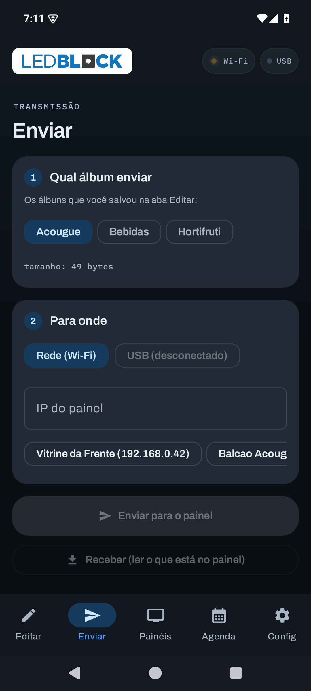
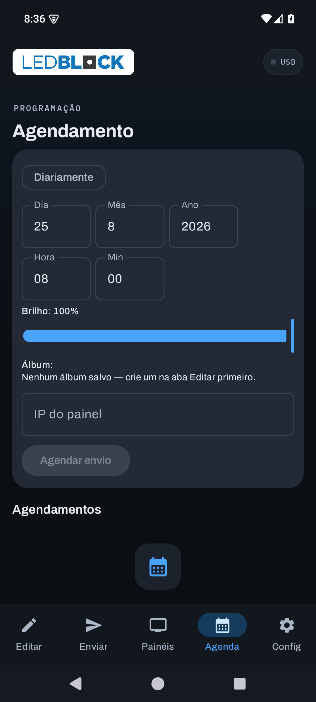
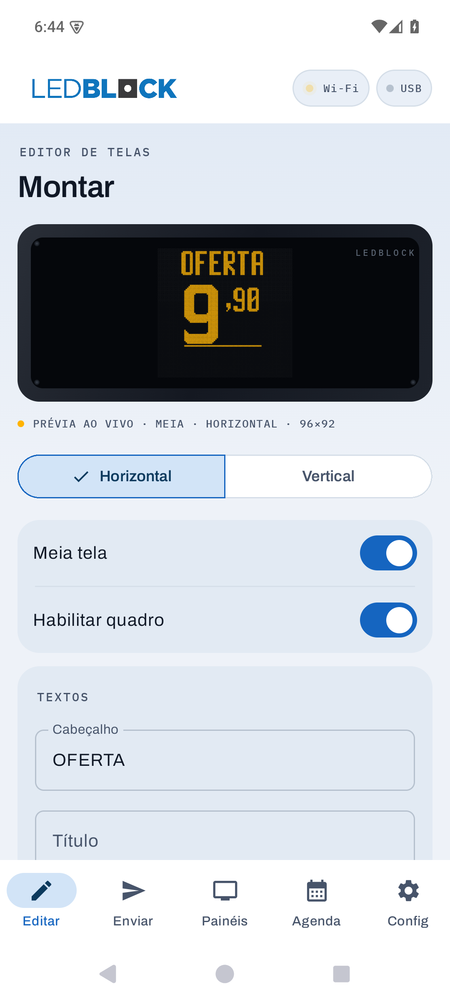
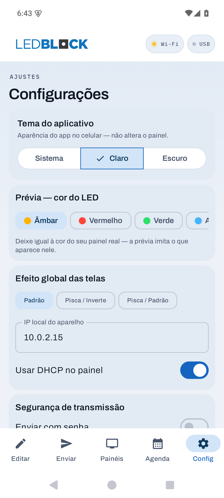

# 📱 Capturas de tela

Telas reais do aplicativo, capturadas em um emulador **Pixel 6 · Android 15 (API 35)**.

> As imagens desta página são capturas do app em execução. Para ver **o que o painel
> de LED exibe** em cada configuração, veja [EXEMPLOS.md](EXEMPLOS.md).

> **Barra superior** — em todas as telas há duas pílulas de status, **Wi-Fi** e **USB**,
> cuja bolinha traduz a fase da conexão: 🟢 online · 🟡 procurando (pulsa) ·
> 🔵 transferindo (pisca) · 🔴 erro · ⚪ desligado.

---

## Editar — o editor de ofertas


A tela principal, organizada em cartões (estilo One UI) que entram em cascata:

- **Prévia de LED ao vivo** dentro da moldura do equipamento (com parafusos e a
  etiqueta LEDBLOCK) — mostra exatamente o que vai para o painel, no tamanho real
- Leitura técnica em fonte monoespaçada: `PRÉVIA AO VIVO · MEIA · HORIZONTAL · 96×92`
- **Orientação** em controle segmentado (Horizontal / Vertical)
- Cartões agrupados: **Interruptores** (Meia tela / Habilitar quadro) · **Textos**
  (Cabeçalho, Título, Subtítulo) · **Preço** (destaque `= R$ 9,90`) · **Complementos**
  colapsável (Medida, Auxiliar, Rodapé)
- **Sequência** — as telas do álbum como chips; reordenar, duplicar e **excluir a
  selecionada**; tempo de exibição por tela
- **Painel** — **Sincronizar** (traz o que já está gravado no painel para a sequência,
  para inserir/excluir onde quiser) e **Limpar** (apaga todo o painel, com confirmação)
- **Álbum** — salvar, **Salvar e enviar**, **Exportar/Importar `.alb`** (interop com o
  app Windows) e abrir álbuns salvos

---

## Enviar — transmissão



Reescrita em **passos numerados**: **1 O que enviar** (escolha do álbum) e
**2 Para onde** (transporte **Rede Wi-Fi** ou **USB** + IP do painel). Os dois botões
são **Enviar para o painel** e **Receber (ler o que está no painel)**. Durante a
transferência aparece um anel de progresso com o percentual; o card **Status**
registra o que está acontecendo em fonte monoespaçada.

Quando o painel de destino já é conhecido, uma **barra de memória** avisa se o
álbum cabe **antes** de enviar.

---

## Painéis — o parque de equipamentos


A **central dos painéis**. O app **varre a rede sozinho** (agora em ~200 ms,
reprocurando a cada poucos segundos) — daí o estado "Procurando painéis…". A linha
**"meu aparelho: 10.0.2.x"** deixa claro que aquele IP é do celular, **não** de um
painel.

Os painéis viram um **histórico persistente**: uma vez pareados, ficam salvos e
reaparecem ao abrir o app **mesmo offline**, com um **chip de status colorido**
(online / instável / offline) e a marca de **"visto há …"**. Cada card tem
**brilho**, **auto-brilho por sensor de luz**, **selo de sincronismo (CRC)** e os
botões Ligar / Desligar / Identificar / Renomear / **Excluir**.

Abaixo, três cartões com **ícone colorido**: **Rede do aparelho** (IP do celular +
DHCP — vindos da antiga aba Config) e, só com o cabo OTG, **Wi-Fi do painel**
(em qual rede ele entra) e **Senha do painel** (definir/remover a senha de
transmissão gravada no equipamento).

---

## Agenda — programação



Agendamento de envio por data e hora, com opção **Diariamente** e **brilho por
tarefa**. Útil para trocar as ofertas da manhã e da tarde automaticamente.

> ⚠️ Hoje o agendamento dispara **com o app aberto** — ver
> [DECISOES §11](DECISOES.md#11-agendamento-em-segundo-plano-adiado).

---

## Config — ajustes e diagnóstico


**Tema do aplicativo** (Sistema / Claro / Escuro — com o aviso de que muda só a
aparência do app, não o painel), **cor do LED na prévia** para combinar com o
painel real, **efeito global das telas**, senha de transmissão e os dois
diagnósticos (do dispositivo e do protocolo). *(O IP do aparelho e o DHCP saíram
daqui para a aba Painéis.)*

---

## Tema claro

O app segue o tema do sistema, ou você força em **Config → Tema**.

<p>

&nbsp;&nbsp;

</p>

> 💡 Repare que **a placa de LED continua preta** nos dois temas — ela representa um
> equipamento físico, que não muda de cor porque o celular está no modo claro.

---

## Identidade visual do projeto


**A marca é o produto em miniatura:** uma matriz de 3×3 LEDs, alguns acesos e
outros apagados — que é exatamente o que um painel de LED é. Nasceu como um
componente Compose de verdade (`LedBlockMark`, em `ui/components/Kit.kt`), pensado
para a barra do app, e virou a imagem conceitual do repositório.

<br clear="left">

| Arquivo | Para que serve |
|---|---|
| [`marca.svg`](marca.svg) | Marca conceitual — cabeçalho do README, ícone/avatar do repositório |
| [`banner.svg`](banner.svg) | Faixa do topo do README: texto renderizado em matriz de LED via `<mask>` + `<pattern>` |
| [`exemplos-painel.svg`](exemplos-painel.svg) | Comparativo de configurações do painel — ver [EXEMPLOS.md](EXEMPLOS.md) |
| [`social-preview.png`](social-preview.png) | Imagem exibida quando o link do repositório é compartilhado (1280×640). A placa é a **captura real do app**, não um desenho |

> Para usar a social preview: **Settings → General → Social preview → Upload an
> image** e envie `docs/social-preview.png`. O GitHub aceita apenas PNG/JPG/GIF —
> por isso essa é a única peça em bitmap.

---

## Como estas capturas foram feitas

Emulador headless, sem intervenção manual:

```bash
# criar e subir o emulador (renderização por software no convidado)
avdmanager create avd -n painel -k "system-images;android-35;default;x86_64" -d pixel_6
emulator -avd painel -no-window -no-audio -no-boot-anim -gpu guest

# instalar e abrir
adb install -r app/build/outputs/apk/debug/app-debug.apk
adb shell am start -n br.com.painelofertas/.ui.MainActivity

# tema escuro e captura
adb shell cmd uimode night yes
adb exec-out screencap -p > docs/capturas/01-editar.png
```

> ⚠️ Com `-gpu swiftshader_indirect` o `screencap` devolve uma imagem **preta** —
> o app renderiza numa superfície acelerada que não entra no framebuffer capturado.
> **`-gpu guest`** força renderização por software no convidado e resolve.
