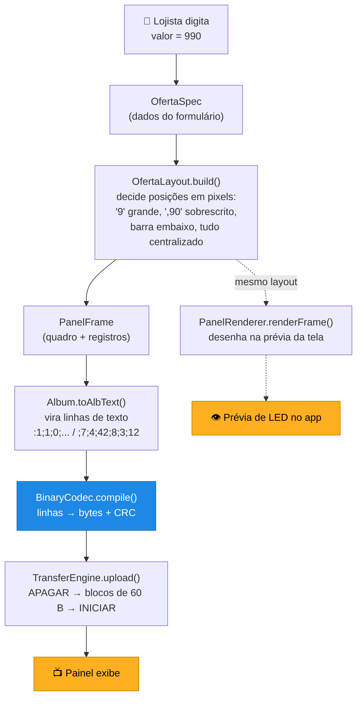

# 🚦 Comece aqui

> **Para quem acabou de clonar o projeto.** Em ~30 minutos você entende o domínio,
> roda o app e sabe onde mexer. Leia nesta ordem.

| | |
|---|---|
| 1. [O problema em 2 minutos](#1-o-problema-em-2-minutos) | 5. [Roteiro de leitura do código](#5-roteiro-de-leitura-do-código) |
| 2. [Glossário (leia antes do código!)](#2-glossário) | 6. [Armadilhas — leia antes de mexer](#6-armadilhas--leia-antes-de-mexer) |
| 3. [Montando o ambiente](#3-montando-o-ambiente) | 7. [Para onde ir agora](#7-para-onde-ir-agora) |
| 4. [O caminho completo de um preço](#4-o-caminho-completo-de-um-preço) | |

---

## 1. O problema em 2 minutos

Uma loja tem um **painel de LED** na parede anunciando preços. Alguém precisa
programar o que aparece nele: *"OFERTA / R$ 9,90 / O KILO"*.

No sistema original isso é feito por um **programa Windows**, que exige um PC ao
lado do painel. **Este projeto faz o mesmo no celular.**

O trabalho do app é:

1. **Montar** o conteúdo (o lojista digita preço, medida, texto)
2. **Desenhar** esse conteúdo em pixels usando as **fontes bitmap do painel**
3. **Compilar** para o formato binário que o controlador entende
4. **Transmitir** por Wi-Fi ou cabo USB, bloco a bloco, com confirmação

E fazer isso **exatamente igual** ao programa Windows — porque o painel na parede
não muda, e o mesmo arquivo tem que funcionar nos dois.

---

## 2. Glossário

**Leia isto antes do código.** O domínio tem palavras específicas que aparecem em
todo lugar (algumas em português, herdadas do sistema original).

| Termo | O que é |
|---|---|
| **Painel** | O equipamento físico de LED na parede da loja |
| **Álbum** | Todo o conteúdo enviado a um painel. Vira um arquivo `.alb`. É a unidade que se salva e se transmite |
| **Quadro** *(frame)* | Uma "tela" dentro do álbum. O painel fica alternando entre os quadros |
| **Oferta** | Tipo de quadro: anúncio de preço (cabeçalho, valor grande, medida, rodapé) |
| **Mensagem** | Tipo de quadro: texto livre posicionado linha a linha |
| **Registro** *(record)* | Um item dentro do quadro: um texto posicionado ou um retângulo gráfico |
| **Slot** | Número que diz **qual campo semântico** o registro é (1=cabeçalho, 4=preço, 5=medida, 6=memo, 9=linha de mensagem…). **Slot 0 = gráfico** |
| **Meia tela / tela cheia** | Largura do painel: ~94 colunas (meia) ou ~186 (cheia) |
| **Consumo** | Quantos **bytes** o álbum ocupa na memória do painel |
| **Brilho** | 0–100%. **Somar 128 liga o sensor de luz** (auto-brilho) |
| **`.flb`** | Arquivo de **fonte bitmap** do painel (5 tamanhos). Ficam em `app/src/main/assets/fonts/` |
| **`.alb`** | Arquivo de álbum. 4 linhas de cabeçalho + linhas de bloco. **Mesmo formato do app Windows** |
| **CRC** | Checksum do conteúdo. O painel reporta o dele; comparar diz se está sincronizado |
| **ESP-AT** | Firmware do módulo Wi-Fi. Aceita comandos de texto tipo `AT+CWJAP="rede","senha"` |
| **Efeito** | Como o quadro entra na tela: Padrão · Pisca/Inverte · Pisca/Padrão |

### Anatomia de um álbum

```
Ofertas da Semana          ← nome
53210                      ← CRC              } cabeçalho .alb
147                        ← consumo (bytes)  } (4 linhas)
100                        ← brilho
:1;1;0;0;0;0;1;1;          ← QUADRO 1 (Oferta, meia tela, ...)
;10;1;5;37;0;OFERTA        ←   registro de texto (slot 1 = cabeçalho)
;7;4;42;8;3;12             ←   registro de texto (slot 4 = preço, fonte 3)
;5;0;61;72;61;89;          ←   registro gráfico (barra sob o preço)
:0;1;3;0;0;0;0;1;          ← QUADRO 2 (Mensagem, 3s de duração...)
;14;9;10;20;1;BEM VINDOS   ←   registro de texto (slot 9 = linha de mensagem)
```

---

## 3. Montando o ambiente

### Opção A — só quero ver o app rodando (2 min)

Não precisa compilar nada:
**[Actions](../../actions)** → clique no último run → seção **Artifacts** →
baixe `painel-ofertas-debug-apk` → instale no celular
(precisa permitir "fontes desconhecidas").

### Opção B — quero desenvolver

1. Instale o **Android Studio** Ladybug (2024.2) ou mais recente — ele já traz JDK, Gradle e o Android SDK
2. `File → Open` → selecione a pasta do projeto
3. Espere o **Gradle Sync** (a primeira vez baixa tudo, pode levar minutos)
4. **Run ▶**

Pelo terminal:
```bash
./gradlew test            # roda os ~33 testes — comece por aqui, é rápido e prova que está tudo certo
./gradlew assembleDebug   # gera o APK em app/build/outputs/apk/debug/
```

<details>
<summary><b>Erros comuns na primeira vez</b></summary>

| Erro | Causa / solução |
|---|---|
| `SDK location not found` | Falta o `local.properties` (ele **não** vai para o Git, é local de cada máquina). O Android Studio cria sozinho ao abrir o projeto. Manualmente: crie o arquivo na raiz com `sdk.dir=C\:\\Users\\SEU_USUARIO\\AppData\\Local\\Android\\Sdk` |
| `Unsupported class file major version` | JDK errado. O projeto usa **Java 17** (veja `compileOptions` em `app/build.gradle.kts`) |
| App instala mas não substitui a versão antiga | Você não incrementou o `versionCode`. Veja [Armadilhas](#6-armadilhas--leia-antes-de-mexer) |
| `gradlew: Permission denied` (Linux/macOS) | `chmod +x gradlew` |

</details>

### Testar sem ter um painel

Você **não precisa** de hardware para desenvolver quase tudo:

- `./gradlew test` exercita o codec, as fontes, o layout e **a máquina de
  transferência inteira** contra um painel simulado
  (veja `app/src/test/.../transfer/TransferEngineTest.kt` — ele implementa um
  `PanelLink` falso que responde `APAGADO`/`NEXT=` como o painel real)
- No app: **Config → Diagnóstico do protocolo** compila os arquivos reais no
  aparelho e confere o CRC. Deve mostrar `✅ OK — 49 bytes, CRC 0xD644`

---

## 4. O caminho completo de um preço

Este é **o fluxo mais importante do projeto**. Siga-o uma vez e você entende tudo.



**A sacada:** o mesmo `PanelFrame` alimenta **os dois caminhos** — a prévia na tela
e os bytes que vão para o painel. Por isso o que você vê é o que o painel mostra.

Arquivos, na ordem em que participam:

1. `ui/screens/EditarScreen.kt` → coleta os campos
2. `render/OfertaLayout.kt` → **posiciona** (o "diagramador")
3. `protocol/ProtocolFields.kt` → estruturas `PanelFrame` / `PanelRecord`
4. `protocol/Album.kt` → serializa para linhas de texto
5. `protocol/BinaryCodec.kt` → **compila** para bytes + CRC
6. `transfer/TransferEngine.kt` → **transmite** em blocos
7. `net/UdpNetwork.kt` **ou** `usb/UsbLink.kt` → põe no fio

---

## 5. Roteiro de leitura do código

Leia **nesta ordem**. Cada arquivo prepara o próximo.

### 🥇 Dia 1 — o núcleo (Kotlin puro, sem Android, fácil de testar)

| # | Arquivo | Por que |
|---|---|---|
| 1 | `protocol/ProtocolFields.kt` | As **estruturas de dados** do domínio: `PanelFrame`, `PanelRecord`, `PanelFont`. Comece aqui |
| 2 | `protocol/Album.kt` | Como um álbum vira texto `.alb` e volta (`AlbumCodec.parseFrames`) |
| 3 | `protocol/BinaryCodec.kt` | ⭐ **O coração.** Texto → bytes. Leia `compile()` linha a linha |
| 4 | `protocol/Crc16.kt` + `AccentMap.kt` | Checksum e o mapa de acentos |
| 5 | `app/src/test/.../BinaryCodecTest.kt` | Os testes mostram os **bytes esperados de verdade** — vale mais que qualquer comentário |

### 🥈 Dia 1 (tarde) — desenho

| # | Arquivo | Por que |
|---|---|---|
| 6 | `render/FlbFont.kt` | Parser das fontes bitmap. Glifo do char `c` está no índice `c.code - 31` |
| 7 | `render/OfertaLayout.kt` | ⭐ Onde o preço vira posições: reais grandes, centavos sobrescritos, barra |
| 8 | `render/PanelRenderer.kt` | Rasteriza o quadro para a prévia |

### 🥉 Dia 2 — comunicação

| # | Arquivo | Por que |
|---|---|---|
| 9 | `net/PanelLink.kt` | ⭐ A **interface** que abstrai UDP e USB. Entenda-a antes das implementações |
| 10 | `net/PanelPacket.kt` | Montagem exata dos pacotes UDP |
| 11 | `net/PanelMessage.kt` | Parser das respostas do painel (`STATUS=`, `NEXT=`, `APAGADO`…) |
| 12 | `transfer/TransferEngine.kt` | ⭐ Upload/download stop-and-wait com retransmissão |
| 13 | `usb/UsbLink.kt` + `UsbHidManager.kt` | O caminho USB (reports de 64 bytes) |
| 14 | `discovery/PanelDiscovery.kt` | Descoberta na rede + heartbeat |

### 🏅 Dia 2 (tarde) — interface

| # | Arquivo | Por que |
|---|---|---|
| 15 | `AppContainer.kt` | Onde tudo é montado (DI manual). O "mapa" das dependências |
| 16 | `ui/MainActivity.kt` | Navegação das 5 abas |
| 17 | `ui/vm/EditorViewModel.kt` | Estado do editor (sobrevive a rotação) |
| 18 | `ui/screens/EditarScreen.kt` | A tela mais complexa |

📖 Detalhe **arquivo por arquivo**: [ARQUITETURA.md](ARQUITETURA.md)

---

## 6. Armadilhas — leia antes de mexer

> Estas são as pegadinhas que fazem perder horas. Quase todas vêm de fidelidade ao
> sistema original: **são assim de propósito.**

<table>
<tr><td width="40">⚠️</td><td>

**`versionCode` precisa aumentar a cada build que você for instalar**
Se você gerar um APK com o mesmo `versionCode` do que já está no celular, o Android
**não atualiza** e você jura que sua mudança "não fez nada". Suba o número em
`app/build.gradle.kts`.

</td></tr>
<tr><td>⚠️</td><td>

**Acentos não existem no painel**
O firmware não tem glifos acentuados. `Á` vira `a`, `Ã` vira `b`, `Ç` vira `i`…
(mapa completo em `protocol/AccentMap.kt`). Qualquer texto que vai para o fio
**precisa** passar por `AccentMap.normalize()` — senão o painel mostra lixo ou,
pior, você injeta um `0xFF` (separador de bloco) e corrompe o conteúdo.

</td></tr>
<tr><td>⚠️</td><td>

**Endianness é assimétrico — e está certo assim**
No **envio**, o offset vai *little-endian* (`offLo`, `offHi`). No **recebimento por
USB**, vem *big-endian* (`buf[0]<<8 | buf[1]`). Não "conserte" isso: é o
comportamento do firmware, copiado do original.

</td></tr>
<tr><td>⚠️</td><td>

**O CRC não cobre os 2 últimos bytes**
`Crc16.xmodem` roda sobre `bytes[0 .. len-3]`. É assim no original; mudar quebra a
comparação com o painel.

</td></tr>
<tr><td>⚠️</td><td>

**Comando de texto leva `CR`; pacote binário não**
`PanelPacket.text()` acrescenta `13` no fim. `erase()` e `dataBlock()` **não**.
E tem a regra bizarra (fiel ao original): se o texto tiver **exatamente 76
caracteres**, insere um espaço antes do `CR`.

</td></tr>
<tr><td>⚠️</td><td>

**`N_DATA = 30` não é o tamanho do bloco**
O bloco tem **60 bytes** (`BLOCK_SIZE`). O `30` é uma constante fixa que o original
escreve no byte 3 do pacote. Parece bug, mas é o protocolo.

</td></tr>
<tr><td>⚠️</td><td>

**Ativar o subtítulo esconde o cabeçalho**
Não é bug: no original, subtítulo ligado ⇒ o painel mostra **Título + Subtítulo**;
desligado ⇒ **Cabeçalho + Título**. Eles disputam a mesma linha do topo.

</td></tr>
<tr><td>⚠️</td><td>

**Brilho `+128` = sensor de luz**
`INICIAR=228` não é "brilho 228" — é `100 + 128`, ou seja, **brilho 100% com
auto-brilho ligado**. Máximo real do brilho é 100.

</td></tr>
<tr><td>⚠️</td><td>

**`protocol/` não pode importar nada de Android**
É o que mantém os testes rodando na JVM, rápido e sem emulador. Se você precisar de
`Context` ali, o desenho está errado — passe o dado já lido por parâmetro.

</td></tr>
<tr><td>⚠️</td><td>

**`0xFF` é separador; `0xFF 0xFF` é fim do fluxo**
Por isso nenhum byte de conteúdo pode ser `255`. A sanitização de texto existe
justamente para garantir isso.

</td></tr>
</table>

---

## 7. Para onde ir agora

| Quero… | Vá para |
|---|---|
| Entender arquivo por arquivo | 📖 [ARQUITETURA.md](ARQUITETURA.md) |
| A especificação completa do protocolo | 📡 [PROTOCOLO.md](PROTOCOLO.md) |
| Fazer uma tarefa específica ("como adiciono um campo?") | 🍳 [RECEITAS.md](RECEITAS.md) |
| Validar contra um painel real | ✅ [HANDOFF.md](../HANDOFF.md) |
| Visão geral do produto | 🏠 [README](../README.md) |

**Dúvida sobre "por que isso é assim?"** — a resposta quase sempre é *"porque o app
Windows faz assim"*. O código-fonte Delphi original (`Ofertas.pas`, 8.546 linhas) é
a fonte da verdade, e os pontos portados citam as linhas de origem nos comentários.
