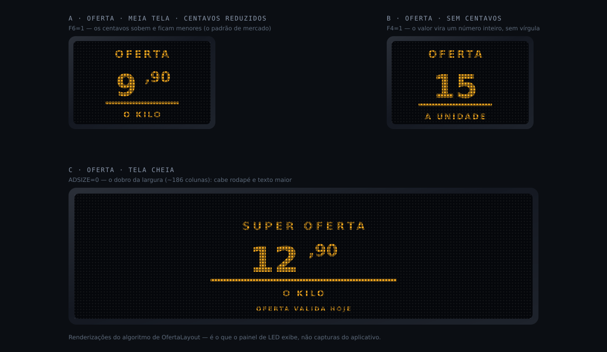

# 🖼️ O que aparece no painel

> As flags do protocolo estão descritas em texto no [PROTOCOLO.md](PROTOCOLO.md) —
> aqui você **vê** o efeito de cada uma.
>
> As imagens abaixo são **renderizações do algoritmo de `OfertaLayout`**, com a
> mesma matriz de pontos do equipamento. Não são capturas do aplicativo: é o que o
> **painel de LED** exibe.

---

## A · Oferta · meia tela · centavos reduzidos

O **padrão de mercado**: reais grandes, centavos menores e elevados.

| | |
|---|---|
| Cabeçalho de quadro | `:1;1;0;0;0;0;1;1;` |
| `TYPE=1` | Oferta |
| `ADSIZE=1` | Meia tela (~94 colunas) |
| `F6=1` | Centavos reduzidos → sobem e diminuem |

**No app:** aba Editar → chip **Reduzidos** ligado.

**Como é montado:** `OfertaLayout` escolhe a fonte dos reais pelo número de dígitos
(≤2 → `42x24`), mede a largura do bloco `reais + ,centavos` e centraliza; os
centavos usam a fonte `17x8L` numa linha acima da base; a barra é um registro
gráfico (`SLOT=0`) sob o preço.

---

## B · Oferta · sem centavos

Para produtos de preço redondo — o valor vira um inteiro.

| | |
|---|---|
| `F4=1` | Centavos desligados |

**No app:** chip **Sem centavos**.

> 💡 Com `F4=1`, os dígitos digitados são o valor inteiro: `15` → **15**, e não
> `0,15`. Já com centavos ligados, `990` → **9,90**.

---

## C · Oferta · tela cheia

O dobro da largura (~186 colunas). Cabe texto maior e o rodapé completo.

| | |
|---|---|
| `ADSIZE=0` | Tela cheia |

**No app:** interruptor **Meia tela** desligado.

> ⚠️ Meia tela e tela cheia são **modos do mesmo equipamento** — quem define é o
> bit `ADSIZE` do quadro, não o modelo do painel. A prévia no app já mostra o
> tamanho real correspondente.

---

## Como as outras opções mudam o resultado

| Opção | Flag | Efeito visual |
|---|---|---|
| Centavos reduzidos | `F6` | Centavos menores e elevados (exemplo **A**) · desligado: centavos do mesmo tamanho, alinhados pela base |
| Centavos 3 casas | `F5` | `9,900` em vez de `9,90` — usado em combustível e granel |
| Sem centavos | `F4` | Só o inteiro, sem vírgula (exemplo **B**) |
| Subtítulo | `F3` | Mostra **Título + Subtítulo** e **esconde o cabeçalho** — os dois disputam a linha do topo |
| Meia tela | `ADSIZE` | Largura ~94 col · desligado: ~186 col (exemplo **C**) |
| Habilitar | `ENABLE` | Se `0`, o quadro fica no álbum mas **não é exibido** na rotação |
| Borda *(só Mensagem)* | `F3`/`F4` | Sem borda · segmentada · contínua |

---

## Acentos: o que você digita × o que é gravado

As fontes do painel só têm glifos para ASCII 32–108. Os acentos são gravados como
placeholders `a`–`l`, e o painel desenha o glifo acentuado correto.

| Você digita | Vai no fio | O painel mostra |
|---|---|---|
| `PROMOÇÃO` | `PROMOibO` | **PROMOÇÃO** |
| `CAFÉ` | `CAFc` | **CAFÉ** |
| `1ª LINHA` | `1j LINHA` | **1ª LINHA** |

Tabela completa: [PROTOCOLO §5](PROTOCOLO.md#5-texto-e-acentos).

---

## Ver na prática, sem painel

O app tem uma **prévia ao vivo** com a mesma matriz de pontos: aba **Editar**, logo
abaixo dos botões. Ela é gerada a partir do **mesmo `PanelFrame`** que vai para o
equipamento — por isso o que você vê é o que o painel exibe
([DECISOES §5](DECISOES.md#5-o-mesmo-panelframe-alimenta-a-prévia-e-o-fio)).

Em **Config → Prévia — cor do LED** dá para escolher a cor (âmbar, vermelho, verde,
azul, branco) para combinar com o seu painel real.
