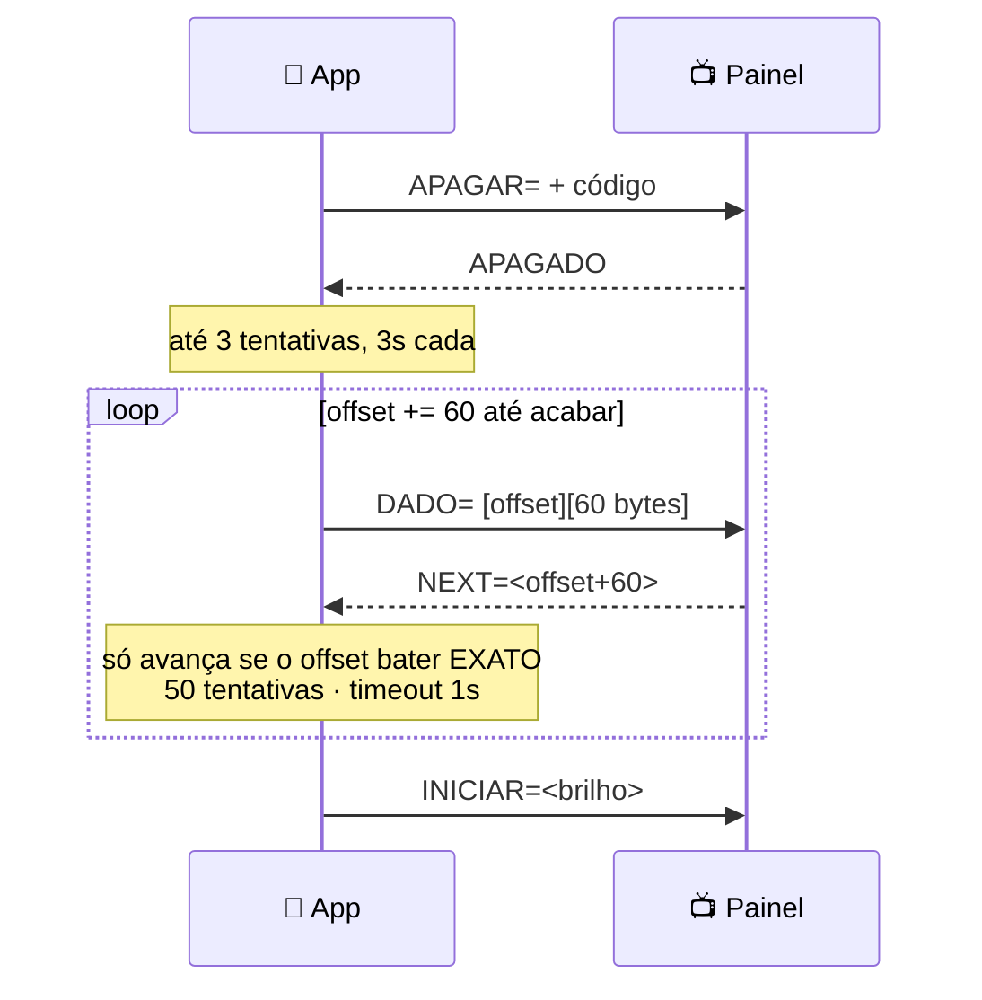
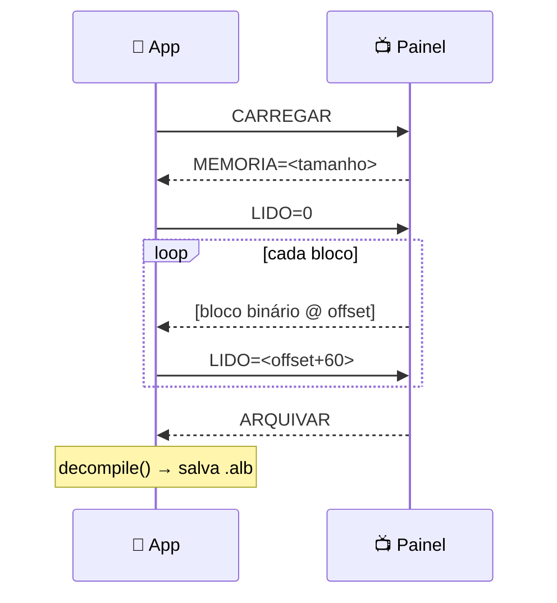

# 📡 Protocolo — referência completa

> Especificação do que trafega entre o app e o painel. Tudo aqui foi **extraído do
> código-fonte Delphi original** (`Ofertas.pas`, 8.546 linhas) e validado
> byte-a-byte contra arquivos reais gerados pelo app Windows.
>
> **Regra de ouro:** quando algo parecer estranho, provavelmente **é assim mesmo**.
> O painel na parede não muda — o app é que tem de falar a língua dele.

---

## Índice

1. [Topologia](#1-topologia)
2. [Camada de texto (formato `.alb`)](#2-camada-de-texto-formato-alb)
3. [Camada binária (o que vai no fio)](#3-camada-binária-o-que-vai-no-fio)
4. [CRC-16](#4-crc-16)
5. [Texto e acentos](#5-texto-e-acentos)
6. [Transporte UDP](#6-transporte-udp)
7. [Transporte USB HID](#7-transporte-usb-hid)
8. [Comandos](#8-comandos)
9. [Transferência](#9-transferência)
10. [Descoberta e telemetria](#10-descoberta-e-telemetria)
11. [Configuração Wi-Fi (ESP-AT)](#11-configuração-wi-fi-esp-at)
12. [Senha de transmissão](#12-senha-de-transmissão)
13. [Vetores de teste](#13-vetores-de-teste)

---

## 1. Topologia

```
📱 Android
    │
    ├── USB OTG ──▶ Ponte USB-HID (Microchip PIC, VID 0x04D8 / PID 0xF002)
    │                     │ UART
    └── UDP ──────▶ Módulo Wi-Fi (ESP8266, firmware ESP-AT, modo transparente)
                          │ UART
                          ▼
                    Controlador do painel  ──▶  Matriz de LED
                    (memória · brilho · sensor · CRC · efeitos)
```

Os **dois caminhos entregam o mesmo conteúdo**. A diferença está só no
enquadramento (framing) — por isso `PanelLink` abstrai os dois.

| | UDP | USB |
|---|---|---|
| Quando usar | Dia a dia (painel já na rede) | Configurar a rede do painel; ou sem Wi-Fi |
| Pré-requisito | Painel na mesma rede | Cabo OTG |

---

## 2. Camada de texto (formato `.alb`)

Um álbum é um arquivo texto (**ISO-8859-1**, quebras **CRLF**):

```
Ofertas da Semana     ← linha 0: nome
53210                 ← linha 1: CRC
147                   ← linha 2: consumo (bytes na memória do painel)
100                   ← linha 3: brilho (0–100; +128 = sensor)
:1;1;0;0;0;0;1;1;     ← linha 4+: blocos
;10;1;5;37;0;OFERTA
```

### Cabeçalho de quadro — linha que começa com `:`

```
:TYPE;ADSIZE;DUR;F3;F4;F5;F6;ENABLE;
```

| Campo | Valores |
|---|---|
| `TYPE` | `1` = Oferta · `0` = Mensagem |
| `ADSIZE` | `1` = meia tela (~94 colunas) · `0` = tela cheia (~186) |
| `DUR` | Índice 0–16 (ver [tabela de duração](#tabela-de-duração)) |
| `F3`–`F6` | Ver abaixo |
| `ENABLE` | `1` = quadro ativo na sequência |

#### Flags F3–F6

**O significado muda conforme `TYPE`** — atenção aqui:

| Flag | Se `TYPE=1` (Oferta) | Se `TYPE=0` (Mensagem) |
|---|---|---|
| `F3` | Subtítulo ativo | Borda (bit 0) |
| `F4` | Centavos desligados | Borda (bit 1) |
| `F5` | Centavos com 3 casas | — |
| `F6` | Centavos reduzidos (sobrescritos) | — |

> ⚠️ **Subtítulo ativo esconde o cabeçalho.** Não é bug: os dois disputam a linha
> do topo. Ligado ⇒ Título + Subtítulo. Desligado ⇒ Cabeçalho + Título.

> 🖼️ **Quer ver o efeito de cada flag?** [EXEMPLOS.md](EXEMPLOS.md) mostra o painel
> renderizado em cada configuração.

#### Tabela de duração

| Índice | 0 | 1 | 2 | 3 | 4 | 5 | 6 | 7 | 8 | 9 | 10 | 11 | 12 | 13 | 14 | 15 | 16 |
|---|---|---|---|---|---|---|---|---|---|---|---|---|---|---|---|---|---|
| **Segundos** | auto | 2 | 3 | 4 | 5 | 6 | 7 | 8 | 9 | 10 | 15 | 20 | 25 | 30 | 40 | 50 | 60 |

### Registro de texto — linha que começa com `;`

```
;LEN;SLOT;ROW;COL;FONT;TEXTO
```

| Campo | Significado |
|---|---|
| `LEN` | `texto.length + 5` (4 bytes de cabeçalho + o CR). **Derivado** — não vai no fio |
| `SLOT` | Campo semântico (ver tabela). **`0` = gráfico** |
| `ROW` / `COL` | Posição em pixels |
| `FONT` | `0`–`4` |
| `TEXTO` | ASCII, do 6º `;` até o fim da linha |

#### Slots conhecidos

| Slot | Campo |
|---|---|
| 1 | Cabeçalho |
| 2 | Título |
| 3 | Subtítulo |
| 4 | Preço (reais + centavos) |
| 5 | Medida |
| 6 | Memo / rodapé |
| 7 | Auxiliar |
| 9 | Linha de mensagem |
| **0** | **Gráfico** (não é texto) |

#### Fontes

| Código | Arquivo | Uso típico |
|---|---|---|
| 0 | `7x4.flb` | Rodapé, medida, textos pequenos |
| 1 | `17x8L.flb` | Cabeçalho, centavos reduzidos |
| 2 | `28x16.flb` | Preço médio, vírgula |
| 3 | `42x24.flb` | Preço grande |
| 4 | `60X35.flb` | Maior tamanho |

### Registro gráfico — `SLOT = 0`

```
;5;0;ROW1;COL1;ROW2;COL2;
```

Retângulo preenchido. Usado como a **barra sob o preço**. Sempre 5 bytes, **sem CR**.

### Canvas

| | Meia tela | Tela cheia |
|---|---|---|
| Colunas | 0–85 | 0–182 |
| Linhas | 0–85 | 0–85 |

Monocromático (sem cor, sem resolução configurável nesta geração de hardware).

---

## 3. Camada binária (o que vai no fio)

`BinaryCodec.compile()` transforma as linhas de texto em bytes.

### Cabeçalho de quadro → **2 bytes**

**Byte 1 — flags empacotadas:**

| Bit | 64 | 32 | 16 | 8 | 4 | 2 | 1 |
|---|---|---|---|---|---|---|---|
| **Campo** | TYPE | ADSIZE | F3 | F4 | F5 | F6 | ENABLE |

**Byte 2 —** duração (índice → byte, via `DurationTable`).

### Registro de texto → `LEN` bytes

```
[SLOT] [ROW] [COL] [FONT] [ascii…] [13]
```

### Registro gráfico → 5 bytes

```
[0] [ROW1] [COL1] [ROW2] [COL2]
```

### Delimitadores

| Sequência | Significado |
|---|---|
| `0xFF` | Separador entre quadros |
| `0xFF 0xFF` | Fim do fluxo |

> ⚠️ Por isso **nenhum byte de conteúdo pode ser `0xFF`** — é o que a
> [normalização de texto](#5-texto-e-acentos) garante.

### Exemplo completo

Entrada (`nelPai` — arquivo real do app Windows):

```
:1;1;0;0;0;0;1;1;
;7;4;42;8;3;12
;6;4;35;65;2;,
;7;4;42;72;1;34
;5;0;61;72;61;89;
;10;1;5;37;0;TESTE
;10;2;16;23;1;TESTE
```

Saída: **49 bytes, CRC `0xD644`** ← é exatamente isso que o
`BinaryCodecTest` verifica.

---

## 4. CRC-16

**CRC-16/XMODEM** — init `0`, polinômio `0x1021`, sem reflexão, sem XOR final.

```kotlin
crc = crc xor (byte shl 8)
repeat(8) { crc = if (crc and 0x8000 != 0) (0x1021 xor (crc shl 1)) else (crc shl 1) }
```

> ⚠️ **Calculado sobre `bytes[0 .. size-3]`** — os **2 últimos bytes ficam de fora**.
> É assim no original (`calculaCRC`). Não "conserte".

Validado contra o vetor canônico: `"123456789"` → `0x31C3`.

**Para que serve:** o painel reporta no `STATUS=` o CRC do que está gravado nele.
Comparando com o CRC do álbum enviado, dá para saber se o painel está sincronizado.

---

## 5. Texto e acentos

As fontes `.flb` só têm glifos para **ASCII 32..108**. Como os textos são forçados
a MAIÚSCULAS, os slots minúsculos `a`..`l` (97..108) ficam livres — e o sistema os
usa para guardar os 12 acentuados do português.

| Original | Vira | | Original | Vira |
|---|---|---|---|---|
| `Á` | `a` | | `Õ` | `g` |
| `Ã` | `b` | | `Ú` | `h` |
| `É` | `c` | | `Ç` | `i` |
| `Ê` | `d` | | `ª` | `j` |
| `Í` | `e` | | `º` | `k` |
| `Ó` | `f` | | `°` | `l` |

**`AccentMap.normalize()`** faz, nesta ordem:
1. `uppercase()`
2. Mapeia os acentuados para `a`..`l`
3. Qualquer caractere **fora de 32..108** vira **espaço**

> 🔒 O passo 3 também é uma **proteção do formato**: impede que um caractere
> exótico (aspas tipográficas, emoji) vire `0xFF` ou `13` no fio e corrompa o
> parsing do álbum no painel.

**Toda** string que vai para o fio ou para a renderização passa por aqui.

---

## 6. Transporte UDP

| | Porta |
|---|---|
| App → painel | **17065** |
| Painel → app | **17066** |

### Formatos

| Tipo | Bytes | CR no fim? |
|---|---|---|
| Comando de texto | `ASCII…` | ✅ `13` |
| `APAGAR=` | `"APAGAR=" + 10 bytes de código` | ❌ |
| `DADO=` | `"DADO=" + offLo + offHi + 2 + 30 + até 60 B` | ❌ |

> 🤨 **Regra estranha, fiel ao original:** se o comando de texto tiver **exatamente
> 76 caracteres**, insere um **espaço** antes do `CR`.

> 🤨 **`N_DATA = 30`** é uma constante fixa escrita no byte 3 — **não** é o tamanho
> do bloco (que é 60).

### Endianness

| Situação | Ordem |
|---|---|
| Offset **enviado** (UDP `DADO=`) | little-endian (`offLo`, `offHi`) |
| Offset **recebido** (USB) | **big-endian** (`buf[0]<<8 \| buf[1]`) |

> ⚠️ A assimetria é **proposital** — comportamento do firmware, copiado do original.

---

## 7. Transporte USB HID

**Microchip · VID `0x04D8` (1240) · PID `0xF002` (61442)**

- No Windows: report de **65 bytes**, com byte 0 = ReportID
- No Android (endpoint de interrupção): só o **corpo de 64 bytes**

### Report de texto

```
[0]=seq  [1]=seq  [2]=CMD_PADRAO(1)  [3]=crc(sempre 0)  [4..]=ASCII  [fim]=13  resto=0
```

### Report de bloco

```
preenchido com 0xFF, depois:
[0]=offLo  [1]=offHi  [2]=CMD_TRANSFER(2)  [3]=30  [4..63]=até 60 bytes
```

> O campo de CRC do report **nunca é calculado nem validado** — sempre `0`, fiel ao original.

### Diferenças em relação ao UDP

| | UDP | USB |
|---|---|---|
| Apagar | `APAGAR=` + código de senha | texto `"APAGAR"` (**sem** código) |
| Bloco | prefixo `"DADO="` | sem prefixo (o CMD no byte 2 identifica) |
| Offset recebido | — | **big-endian** |

---

## 8. Comandos

### App → painel

| Comando | Efeito |
|---|---|
| `SERVIDOR=<ip>` | Anuncia o app na rede (usado na varredura) |
| `STATUS` | Pede telemetria |
| `ONLINE` | Handshake de presença |
| `ONLINE=<índice>` | **Aplica o efeito global** (0=Padrão, 1=Pisca/Inverte, 2=Pisca/Padrão) |
| `INICIAR=<brilho>` | Liga e define o brilho. **`+128` ativa o sensor de luz** |
| `ONOFF=0` | Desliga o painel |
| `APAGAR=` +10 B | Prepara para gravar |
| `DADO=` + bloco | Envia um bloco de 60 bytes |
| `CARREGAR` | Pede o conteúdo atual (download) |
| `LIDO=<offset>` | Confirma bloco recebido |
| `SENHA=` | Grava a senha de transmissão |

### Painel → app

| Resposta | Significado |
|---|---|
| `CONECTADO.` | Presente na rede |
| `ONLINE` | Handshake |
| `STATUS=…` | Telemetria (ver [seção 10](#10-descoberta-e-telemetria)) |
| `APAGADO` | Memória limpa, pronto para receber |
| `NEXT=<offset>` | Ack do bloco enviado |
| `MEMORIA=<n>` | Tamanho do conteúdo (início do download) |
| `ARQUIVAR` | Fim do download |
| `NEGADO` | Senha incorreta |
| `OK` / `FAIL` / `ERROR` | Respostas de comandos AT |
| `FIM_SSID` | Fim da lista de redes |

### Brilho e sensor

```
INICIAR=80    → brilho 80%, sensor desligado
INICIAR=208   → 80 + 128 → brilho 80% com AUTO-BRILHO ligado
INICIAR=228   → 100 + 128 → brilho máximo com auto-brilho (usado no "Identificar")
```

O bit **128** liga o sensor de luz ambiente. O valor real do brilho é `x & 127`.

---

## 9. Transferência

### Envio (upload) — *stop-and-wait*



**Por que o ack tem de bater exato?** Se chegar um `NEXT=` de um bloco antigo
(retransmissão duplicada), avançar seria pular conteúdo. O original loga
"Chegou NEXT antigo" e ignora — aqui a comparação `it.offset == offset` faz o mesmo.

### Recebimento (download)



### Tempos e limites

| Constante | Valor | Onde |
|---|---|---|
| Tentativas de apagar | 3 | `ERASE_ATTEMPTS` |
| Timeout do apagar | 3 s | `ERASE_TIMEOUT` |
| Tentativas por bloco | **50** | `BLOCK_ATTEMPTS` (a "insistencia" do original) |
| Timeout por bloco | 1 s | `BLOCK_TIMEOUT` |
| Timeout do `MEMORIA=` | 5 s | `MEMORY_TIMEOUT` |
| Watchdog do download | 3 s | `DOWNLOAD_WATCHDOG` |
| Teto de download | 2 MB | `MAX_DOWNLOAD_BYTES` (sanidade contra `MEMORIA=` malformado) |

---

## 10. Descoberta e telemetria

### Varredura

`SERVIDOR=<ip-do-android>` em **unicast** para toda a sub-rede /24, em **5 lotes**
(1–50, 51–100, 101–150, 151–200, 201–254) com **10 s** entre lotes.

### `STATUS=` — o pacote mais informativo

```
STATUS=id,estado,?,?,mem_ini,mem_fim,crc,intensidade
        0    1    2 3     4       5    6      7
```

| Índice | Campo | Uso |
|---|---|---|
| 0 | `id` | Identificador do painel |
| 1 | `estado` | Estado do controlador |
| 4 | `mem_ini` | Início da memória livre |
| 5 | `mem_fim` | Fim da memória |
| 6 | **`crc`** | CRC do conteúdo **gravado no painel** → selo de sincronismo |
| 7 | **`intensidade`** | **Leitura do sensor de luz** ao vivo |

**Memória livre** = `mem_fim − mem_ini`. É com isso que o app avisa se o álbum cabe.

> 💡 Ao receber um `STATUS=`, o app **responde `ONLINE=<efeito>`**. É assim que o
> efeito global (Pisca/Inverte etc.) chega ao painel — não há comando dedicado.

### Heartbeat

A cada 3 s o app incrementa um contador de falhas por painel:

| Falhas | Estado |
|---|---|
| ≤ 5 | 🟢 online |
| 6–10 | 🟠 instável |
| > 10 | ⚫ offline |

---

## 11. Configuração Wi-Fi (ESP-AT)

Feita **por USB** (o painel ainda não está na rede).

### Ler configuração e escanear

```
EXIT
CMD=AT+CIPSTA?      → +CIPSTA:ip:"..." / netmask / gateway
CMD=AT+CWDHCP?      → estado do DHCP
CMD=AT+CWJAP?       → +CWJAP:"rede_atual"
CMD=AT+CWLAP        → lista de redes, até chegar FIM_SSID
```

### Entrar na rede (cada passo espera `OK`)

```
EXIT
CMD=AT+CWMODE=1
CMD=AT+CWJAP="<ssid>","<senha>"
CMD=AT+CWDHCP=1,1                                 ← se DHCP
CMD=AT+CIPSTA="<ip>","<gateway>","<mascara>"      ← se IP fixo
CMD=AT+CIPMUX=0
CMD=AT+CIPMODE=1
CMD=AT+SAVETRANSLINK=1,"<ip-do-android>",17066,"UDP",17065
CMD=AT+CIPSEND
```

O `SAVETRANSLINK` é o passo-chave: coloca o módulo em **modo transparente**,
escutando UDP na 17065 e mandando as respostas para o app na 17066.

### Consulta de identidade (read-only)

```
CMD=AT+GMR      → versão do firmware AT + SDK
CMD=AT+CIFSR    → +CIFSR:STAMAC,"aa:bb:cc:dd:ee:ff" / STAIP,"192.168.0.42"
```

> ⚠️ **Não invente comandos** para "descobrir recursos" num painel em produção.
> Comando desconhecido pode travar ou resetar o controlador. Exploração de firmware
> se faz em bancada, com o fabricante.

---

## 12. Senha de transmissão

Opcional. Quando ativa, o `APAGAR=` leva **10 bytes de código** derivados da senha
+ do horário (anti-replay). Se estiver errada, o painel responde **`NEGADO`**.

> **Sem senha configurada (padrão), o código é `[0,0,0,0,0,0,0,0,0,0]`** —
> verificado no fonte original.

É **ofuscação fraca**, não criptografia: embaralhamento de bits com XOR por uma
chave derivada dos 3 últimos dígitos do timestamp. Portado fiel; o caminho **com**
senha precisa de validação em campo.

---

## 13. Vetores de teste

Use estes para provar que qualquer mudança no codec continua correta.
Estão em `app/src/test/.../protocol/BinaryCodecTest.kt`.

### `nelPai` — uma oferta

```
:1;1;0;0;0;0;1;1;
;7;4;42;8;3;12
;6;4;35;65;2;,
;7;4;42;72;1;34
;5;0;61;72;61;89;
;10;1;5;37;0;TESTE
;10;2;16;23;1;TESTE
```
→ **49 bytes · CRC `0xD644`**

### `mensagem`
→ **111 bytes · CRC `0x06A2`**

### CRC canônico
`"123456789"` → **`0x31C3`**

> 🧪 O app também traz esse autoteste embarcado:
> **Config → Diagnóstico do protocolo** compila `nelPai` no próprio aparelho e
> mostra `✅ OK — 49 bytes, CRC 0xD644`.

---

## Fonte da verdade

Todo este documento foi derivado de `Ofertas.pas` (código Delphi original). Pontos
de referência citados no código Kotlin:

| Rotina original | Portada em |
|---|---|
| `processaArquivo` / `construirArquivo` | `protocol/BinaryCodec.kt` |
| `calculaCRC` | `protocol/Crc16.kt` |
| `imprimir_tela` (parser de fonte + acentos) | `render/FlbFont.kt` · `protocol/AccentMap.kt` |
| `Monta_Oferta` | `render/OfertaLayout.kt` |
| `EnviarPckUDP` / `Timer4Timer` | `net/PanelPacket.kt` |
| `EnviarUSB` / `HIDCtrlDeviceData` | `usb/UsbLink.kt` |
| `BitBtn1Click` / `BitBtn3Click` / `Timer4` / `Timer5` | `transfer/TransferEngine.kt` |
| `IdUDPServer1UDPRead` / `Timer2` / `Timer3` | `discovery/PanelDiscovery.kt` |
| `Encriptor` | `net/Encriptor.kt` |
| `SalvaBrilho` (bit 128 do sensor) | `ui/screens/PaineisScreen.kt` |
